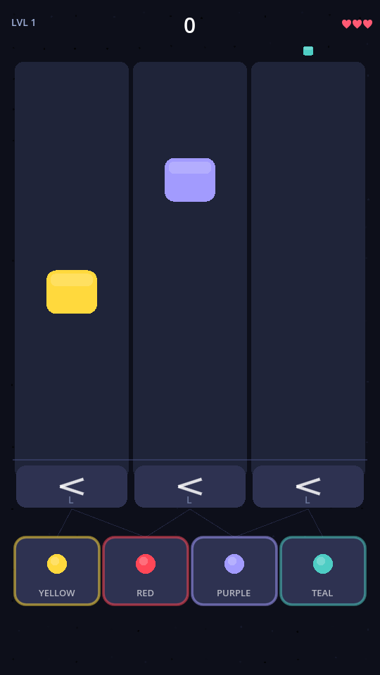

<div align="center">



# Flow Your Boat

[](https://godotengine.org) [](https://docs.godotengine.org/en/stable/tutorials/scripting/gdscript/) [](https://developer.android.com) [](LICENSE)

An endless flow-sorting game built for Android. Designed for ADHD brains — always moving, never waiting, satisfying to run clean.

</div>

---

## How to play

Colored blocks fall through three lanes simultaneously. At the bottom of each lane is a **gate** — tap it to flip which bin the block routes to. Match every block to its color bin before it lands wrong.

The system runs itself. Your job is to keep it running.

---

## Mechanics

| Element | Behavior |
| --- | --- |
| **Gates** | Tap to toggle left/right routing — holds direction until you change it |
| **Bins** | 4 color-coded bins, layout shuffles on each level |
| **Lanes** | 3 at start, scales to 5 as difficulty increases |
| **Combo** | Consecutive correct sorts multiply your score |
| **Lives** | 3 total — lose one each time a block lands in the wrong bin |
| **Speed** | Increases every 30 seconds |

---

## Built with

- [Godot 4](https://godotengine.org) — GDScript, entirely code-first (no editor-built scenes)
- Procedural audio via `AudioStreamGenerator` — no audio files
- Procedural visuals via `CanvasItem._draw()` — no external assets
- Android target, portrait orientation, touch input

---

## Project structure

```
scripts/
  autoload/          GameState, Palette, Effects, SaveData
  Main.gd            Game world — layout, routing logic, central input handler
  FlowItem.gd        Falling colored block
  Gate.gd            Tap-to-toggle routing switch
  Bin.gd             Color-matched collection bin
  HUD.gd             Score, lives, combo, level banner, danger pulse
  GameOver.gd        End screen with persistent best score
  Audio.gd           Procedural sound effects
  Background.gd      Animated dot-grid background
tools/
  capture.ps1        Automated screenshot for visual testing
  test.ps1           Smart AI player — validates score/lives regression
```

---

## Development

Requires [Godot 4](https://godotengine.org/download). Open the project folder in the Godot editor and hit **F5**.

```bash
# Run the automated test suite (validates routing logic, scoring, lives)
.\tools\test.ps1

# Take a visual screenshot for inspection
.\tools\capture.ps1
# Output: %APPDATA%\Godot\app_userdata\Flow Sorter\debug_screenshot.png
```

---

## License

MIT
